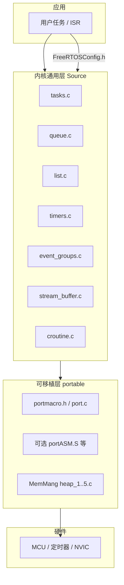

# FreeRTOS 软件代码架构说明

本文档基于本仓库路径 `FreeRTOS/FreeRTOS` 下的源码树整理，描述**目录划分**、**内核与可移植层边界**、**主要模块职责**及**集成时的依赖关系**。若上游版本更新，请以实际文件为准。

---

## 1. 仓库顶层结构

| 目录 | 作用 |
|------|------|
| `Source/` | **内核源码**：与 MCU 无关的通用 RTOS 逻辑，以及 `portable/` 可移植层。 |
| `Demo/` | **官方演示工程**：按芯片/工具链组织的示例，用于验证移植与配置。 |
| `Test/` | **测试与形式化验证**：单元测试、目标板集成测试、CBMC/VeriFast 等证明或分析资产。 |
| `License/` | 许可证相关文件。 |
| `README.md` | 入口说明，指向官方目录结构文档与快速开始链接。 |

内核与演示、测试在物理目录上分离：**产品集成通常以 `Source` 为主，`Demo` 为参考模板**。

---

## 2. 逻辑分层概览

FreeRTOS 在结构上可理解为三层：

1. **应用层**：用户任务、中断服务程序、业务逻辑；通过公开 API（`task.h`、`queue.h`、`semphr.h` 等）调用内核。
2. **内核通用层**（`Source/*.c` + `Source/include/*.h`）：调度、同步对象、定时器等，**不直接写具体汇编**，通过可移植层回调完成上下文切换与临界区。
3. **可移植层**（`Source/portable/...`）：与**编译器 + 架构 + 芯片**相关的 `port.c` / `portmacro.h`（及汇编文件）、SysTick 或硬件定时器、中断嵌套策略等；另含 **MemMang** 堆实现。

---

## 3. 内核通用层（`Source/`）

### 3.1 与架构无关的 `.c` 实现文件

本树中位于 `Source/` 根目录、构成 RTOS 核心的实现文件如下：

| 源文件 | 主要职责 |
|--------|----------|
| `tasks.c` | 任务控制块（TCB）、就绪列表、调度器启停、任务创建/删除/挂起、延时、优先级与 **SMP（`configNUMBER_OF_CORES`）** 相关调度路径等。 |
| `queue.c` | 队列实现；互斥量、计数/二值信号量等常作为队列的特例或薄封装使用（API 在 `queue.h` / `semphr.h`）。 |
| `list.c` | 内核内部双向链表抽象，为就绪队列、延时列表、事件等待链表等提供基础数据结构。 |
| `timers.c` | 软件定时器服务（定时器守护任务、定时器队列），依赖 `configUSE_TIMERS`。 |
| `event_groups.c` | 事件组（多事件位同步），依赖 `configUSE_EVENT_GROUPS`。 |
| `stream_buffer.c` | 流缓冲与消息缓冲（字节流 / 定长消息），可与任务通知等配合使用。 |
| `croutine.c` | **协程**（合作式调度）支持；多数新项目以抢占式任务为主，此模块可按需排除。 |

### 3.2 公开头文件（`Source/include/`）

应用与中间件通常包含的主入口为 **`FreeRTOS.h`**，其典型链式依赖为：

- `FreeRTOSConfig.h`（由工程提供，**非**内核自带）
- `projdefs.h`（内核基础类型与宏）
- `portable.h` → 通过包含路径解析到具体端口的 `portmacro.h`

其余头文件按功能划分，例如：

- `task.h`：任务 API  
- `queue.h` / `semphr.h`：队列与信号量 API  
- `timers.h`、`event_groups.h`、`stream_buffer.h`、`croutine.h`  
- `atomic.h`：与原子操作相关的声明/宏（依端口与配置）  
- `mpu_*.h`：MPU 端口下的系统调用与封装相关声明  

**配置中心**是 `FreeRTOSConfig.h`：通过一系列 `config*` 宏打开或裁剪功能（如软件定时器、事件组、静态分配、钩子函数等），并影响 `tasks.c` 等文件中的条件编译分支。

---

## 4. 可移植层（`Source/portable/`）

### 4.1 目录组织约定

`portable/readme.txt` 中的约定仍适用：

- **`portable/MemMang/`**：五种示例堆管理实现（`heap_1.c` … `heap_5.c`），工程**任选其一**与内核链接；语义与适用场景见官方说明（固定块、合并空闲、多区域等）。
- **`portable/<编译器>/<架构或芯片>/`**：具体端口的 `port.c`、`portmacro.h`，以及部分端口的汇编文件（如 `portASM.S`）。

本仓库中可见的编译器/工具链顶层目录包括（节选）：`GCC`、`IAR`、`Keil`、`ARMClang`、`CCS`、`RVDS`、`MSVC-MingW`、`Renesas`、`ThirdParty` 等。**同一架构可能存在多个厂商或板级变体**，集成时以 Demo 或官方文档推荐路径为准。

### 4.2 `portable/Common` 与 `ThirdParty`

- **`Common`**：多端口共享的辅助实现（若存在），减少重复代码。  
- **`ThirdParty`**：社区或合作伙伴维护的移植（如部分 POSIX、Xtensa 等），使用前需阅读各子目录的 README 与许可证。

### 4.3 可移植层必须提供的抽象

各端口通过 `portmacro.h` / `port.c` 等实现内核所需的“钩子”，包括但不限于（具体名称以 `portable.h` 与各端口为准）：

- 临界区进入/退出（与中断屏蔽策略相关）  
- 上下文切换触发（PendSV 或等价机制）  
- 首个任务启动（`portSTART_FIRST_TASK` 等）  
-  tick 计数递增（通常与 `xTaskIncrementTick` 联动）  
- 栈生长方向、数据对齐、`StackType_t` / `BaseType_t` 等类型宽度  

内核代码**只调用这些抽象**，从而实现同一套 `tasks.c`/`queue.c` 跨平台复用。

---

## 5. 演示与测试（`Demo/`、`Test/`）

### 5.1 `Demo/`

每个官方端口通常对应一个或多个子目录，内含：

- 已配置好的工程文件（如 `.eww`、`.uvprojx`、`CMakeLists.txt` 等，因端口而异）  
- 应用层 `main` 与示例任务  
- 已指向正确的 `portable` 子目录与 `heap_x.c`  

**新工程最快路径**：复制最接近目标板的 Demo，再逐步替换应用代码。

### 5.2 `Test/`

根据 `Test/README.md`，当前方向包括：

| 子目录 | 用途（摘要） |
|--------|----------------|
| `CBMC` | 针对部分代码路径的自动化证明（内存安全等）。 |
| `CMock` | 内核 API 的单元测试。 |
| `Target` | 在真实目标机上的集成测试。 |
| `VeriFast` | 形式化验证相关资产。 |

日常产品开发可不必编译整个 `Test` 树；其存在表明内核与端口在质量流程上与通用源码同等重要。

---

## 6. 构建与包含路径（集成要点）

典型集成需要：

1. **编译** `Source/` 下上述 `.c` 中实际启用的模块（例如不使用协程则可不编译 `croutine.c`）。  
2. **编译** 选定端口目录下的 `port.c`（及汇编文件）。  
3. **编译** `MemMang` 中选定的 **一个** `heap_*.c`。  
4. **包含路径** 至少包含：  
   - `Source/include`  
   - 所选端口目录（以便找到 `portmacro.h`）  
5. 在应用或公共前缀头文件中提供 **`FreeRTOSConfig.h`**。  

CMake 用户可参考 `Source/include/CMakeLists.txt` 及具体 Demo 中的现代构建示例。

---

## 7. 与本仓库副本相关的说明

- 内核头文件注释中标有 **Development branch** 字样时，表示该副本可能跟踪主线开发分支；生产环境宜选用 **LTS 标签** 或与芯片厂商 BSP 锁定的版本。  
- **SMP**：`FreeRTOS.h` 中存在 `configNUMBER_OF_CORES` 等默认定义，多核行为集中在 `tasks.c` 等与调度相关的路径中，具体能力仍依赖端口是否支持 SMP。  
- **MPU / 安全扩展**：部分 ARMv8-M 等端口涉及 `configENABLE_PAC`、`configENABLE_BTI` 等选项，需与对应 `portable` 子目录一并阅读。

---

## 8. 延伸阅读（官方）

- 目录与文件定位：[FreeRTOS Source Organization](https://www.freertos.org/a00017.html)  
- 快速开始：[Quick Start Guide](https://freertos.org/Documentation/01-FreeRTOS-quick-start/)  

---

*文档生成日期：2026-04-24；分析对象：`/home/work2/flushbonading/FreeRTOS/FreeRTOS`。*
